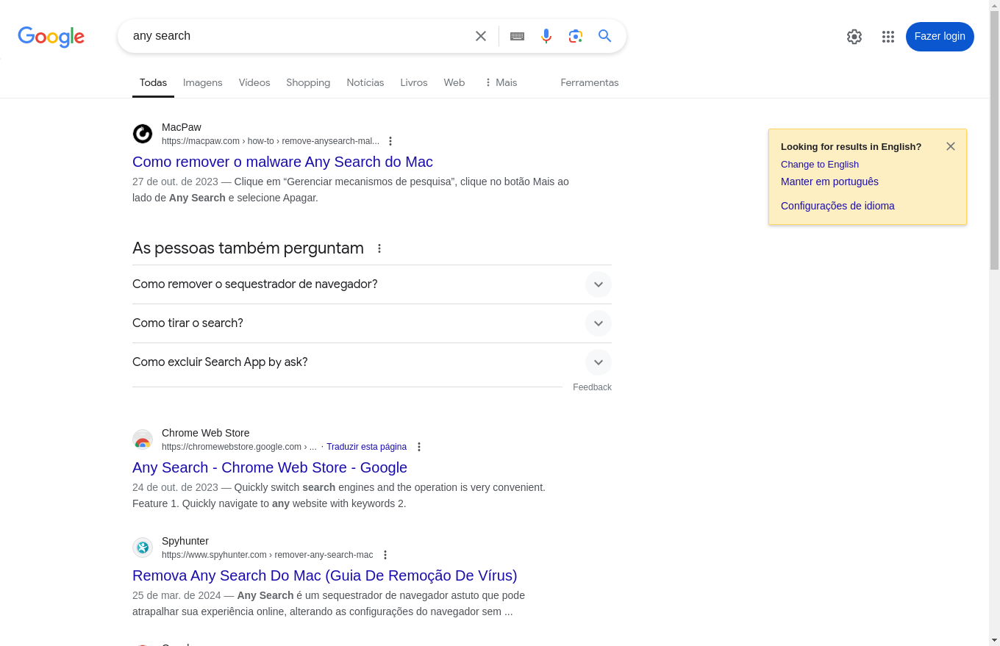

By default, all screenshot methods save the files in the current active directory.

```python
>>> app = FastRPA()
>>> web = app.browse('https:...')

# Get a PNG bytes content from the current viewport size
>>> web.screenshot.image
b'\x89PNG\r\n\x1a\n\x00\x00...'

# Save a PNG file from the current viewport size
>>> web.screenshot.save_image()
>>> web.screenshot.save_image('/my/screenshot/path.png')

# Get a PNG bytes content from the complete page
>>> web.screenshot.full_page_image
b'\x89PNG\r\n\x1a\n\x00\x00...'

# Save a PNG file from the complete page
>>> web.screenshot.save_full_page()
>>> web.screenshot.save_full_page('/my/screenshot/path.png')
```

You can see examples of both screenshot methods below.

| `web.screenshot.image` | `web.screenshot.full_page_image` |
|-|-|
|  |  |