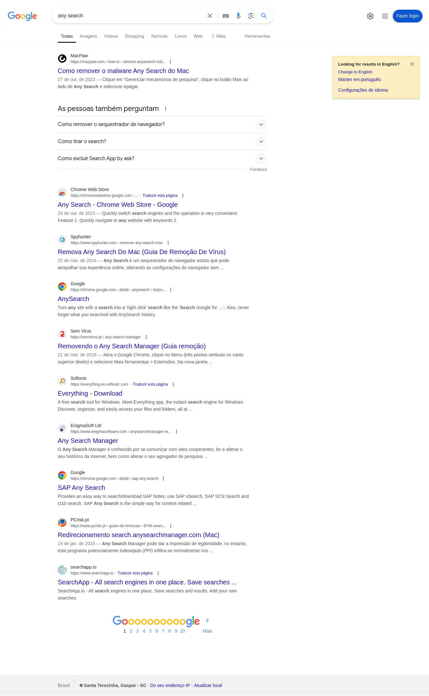

By default, all screenshot methods save the files in the current active directory.

## Accessing the object

```python linenums="1"
app = FastRPA()
web = app.browse('https:...')
type(web.screenshot)
```

```python title="Output"
fastrpa.core.screenshot.Screenshot
```

## Reference

### Get a PNG bytes content from the current viewport size

```python linenums="1"
web.screenshot.image
```

```python title="Output"
b'\x89PNG\r\n\x1a\n\x00\x00...'
```

### Save a PNG file from the current viewport size

To just save on the current workdir.

```python linenums="1"
web.screenshot.save_image()
```

Or, if needed, specify the path.

```python linenums="1"
web.screenshot.save_image('/my/screenshot/path.png')
```

!!! info "Viewport screenshot example"
    

### Get a PNG bytes content from the complete page

```python linenums="1"
web.screenshot.full_page_image
```

```python title="Output"
b'\x89PNG\r\n\x1a\n\x00\x00...'
```

### Save a PNG file from the complete page

To just save on the current workdir.

```python linenums="1"
web.screenshot.save_full_page()
```

Or, if needed, specify the path.

```python linenums="1"
web.screenshot.save_full_page('/my/screenshot/path.png')
```

!!! info "Full page screenshot example"
    
