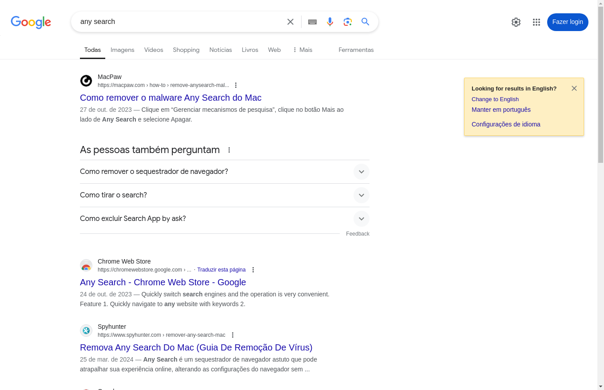

Por padrão, todos os métodos de captura de tela salvam os arquivos no diretório ativo atual.

## Acessando o objeto

```python linenums="1"
app = FastRPA()
web = app.browse('https:...')
type(web.screenshot)
```

```python title="Saída"
fastrpa.core.screenshot.Screenshot
```

## Referência

### Obter o conteúdo em bytes de uma imagem PNG do tamanho da viewport atual

```python linenums="1"
web.screenshot.image
```

```python title="Saída"
b'\x89PNG\r\n\x1a\n\x00\x00...'
```

### Salvar um arquivo PNG do tamanho da viewport atual

Para salvar no diretório de trabalho atual.

```python linenums="1"
web.screenshot.save_image()
```

Ou, se necessário, especifique o caminho.

```python linenums="1"
web.screenshot.save_image('/meu/caminho/screenshot.png')
```

!!! info "Exemplo de captura de tela da viewport"
    

### Obter o conteúdo em bytes de uma imagem PNG da página completa

```python linenums="1"
web.screenshot.full_page_image
```

```python title="Saída"
b'\x89PNG\r\n\x1a\n\x00\x00...'
```

### Salvar um arquivo PNG da página completa

Para salvar no diretório de trabalho atual.

```python linenums="1"
web.screenshot.save_full_page()
```

Ou, se necessário, especifique o caminho.

```python linenums="1"
web.screenshot.save_full_page('/meu/caminho/screenshot.png')
```

!!! info "Exemplo de captura de tela da página completa"
    
